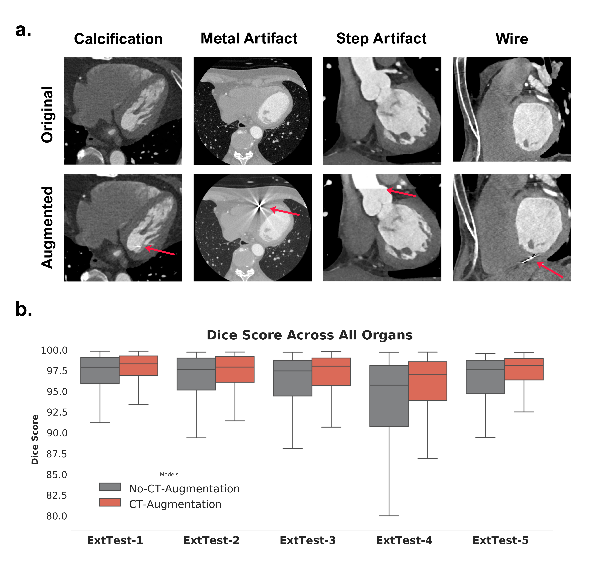

# CTAug


**CTAug** is an open-source Python library of cardiac CT (CCT)–specific data augmentations, developed to improve the robustness of segmentation models to clinical image degradation. It was introduced as part of a unified framework for comprehensive cardiac CT segmentation and phenotyping (Mohammadi Kazaj et al., 2026).

> A Unified Framework for Comprehensive Cardiac CT Segmentation and Phenotyping: Human-in-the-Loop Data Annotation, Vision Foundation Model Development, Multicenter Evaluation and Clinical Validation
> [arXiv:2607.11287](https://arxiv.org/abs/2607.11287)

## Overview

Clinical cardiac CT scans frequently contain artifacts — metallic implants, pacemaker wires, calcifications, and step-and-shoot acquisition motion — that are underrepresented in curated training datasets but common in routine practice. CTAug simulates these artifact categories during training to close that gap, without requiring additional annotated data.

Across five external test datasets, training segmentation models with CTAug increased mean Dice score from 95.5 to 96.3 (Wilcoxon signed-rank test, p < 0.001 across all comparisons), with the largest benefit observed on the most artifact-rich cohort (94.81 vs. 92.45 Dice), where it raised the lower tail of the Dice distribution and narrowed its spread.


*(a) Representative original vs. augmented image pairs for each simulated artifact category; red arrows indicate the introduced artifacts. (b) Dice score across all structures on the five external test datasets for models trained without (gray) vs. with (red) CTAug. Source: Supplementary Figure S1, [arXiv:2607.11287](https://arxiv.org/abs/2607.11287).*

## Augmentations

| Augmentation | Description | Default probability |
|---|---|---|
| Calcification | Simulated as small, high-HU deposits | 15% |
| Wire | Linear or curvilinear high-HU structures (e.g., pacemaker leads) | 15% |
| Metal | High-HU regions with radiating bright and dark streak artifacts | 10% |
| Step-and-shoot | Stepwise intensity discontinuities with 1–2.5% spatial shifts, simulating gated acquisition motion | 10% |

For metal, wire, and calcification augmentations, placement is guided by the segmentation mask to ensure anatomically plausible localization.

## Installation

_Coming soon._

## Usage

_Coming soon._

## Citation

If you use CTAug in your research, please cite:

```bibtex
@article{mohammadikazaj2026ctaug,
  title   = {A Unified Framework for Comprehensive Cardiac CT Segmentation and Phenotyping: Human-in-the-Loop Data Annotation, Vision Foundation Model Development, Multicenter Evaluation and Clinical Validation},
  author  = {Mohammadi Kazaj, Pooya and Weber, Leo Fridolin and Xie, Wen and Safavi-Naini, Seyed Amir Ahmad and Stark, Anselm and Baj, Giovanni and Mokhtari, Ali and Yoshida, Toshiya and Ryffel, Christoph and Okuno, Taishi and Akashi, Yoshihiro and Buechel, Ronny R. and Pilgrim, Thomas and Valenzuela, Waldo and Siontis, George C. M. and Xu, Xiaowei and Hundertmark, Moritz and Windecker, Stephan and Grani, Christoph and Shiri, Isaac},
  journal = {arXiv preprint arXiv:2607.11287},
  year    = {2026}
}
```

## Related repositories

CTAug is one component of a larger, openly released framework:

- [CCT-FM](https://github.com/AI-in-Cardiovascular-Medicine/CCT-FM) — model training, inference, and evaluation code
- [nnUZoo](https://github.com/ai-in-Cardiovascular-Medicine/nnUZoo) — segmentation model architectures
- [HolOrama](https://github.com/AI-in-Cardiovascular-Medicine/HolOrama) — graphical user interface for cardiac CT

The associated annotated dataset is available on [Hugging Face](https://huggingface.co/datasets/AI-CVM/Cardiac-CT).

## License

See [LICENSE](LICENSE).
